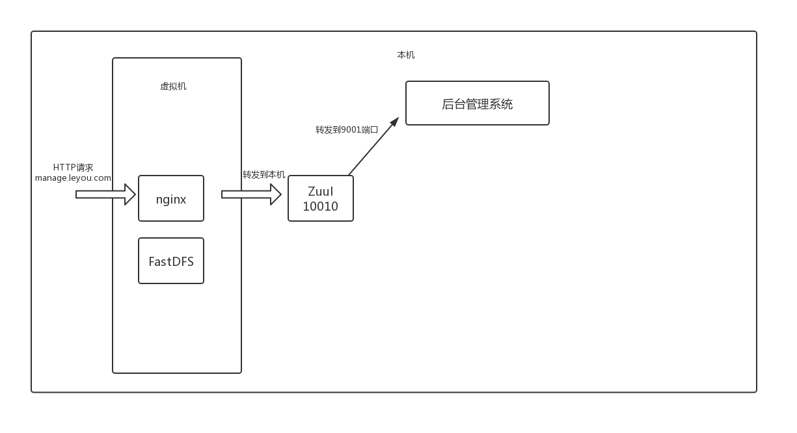

---

typora-copy-images-to: assets
---

# 0x0 引言
## 1.学习目的
1. 直接目的：搭建一个B2C购物网站
2. 间接起因：复习JavaWeb开发Spring框架，了解学习前沿技术：SpringBoot、SpringCloud、消息队列等中间件

## 2.项目总览
### 2.1 项目架构
前台域名：www.mio4.com

后台管理域名： manage.leyou.com

服务器：阿里云1核2GB CentOS 6.9 

- [x] DNS域名绑定
- [ ] 域名备案
- [ ] 开启80、8080 | 8001、9002、10086、10010端口
- [x] 配置FastDFS，tracker端口22122，storage端口23000
- [x] 配置Nginx
- [ ] MySQL
- [ ] JDK 8

整体架构：
1. 本地模拟



(1) 本机通过浏览器发送一个HTTP请求，比如manage.leyou.com

(2) Windows hosts文件中manage.leyou.com解析到IP 10.136.51.13 

(3) 浏览器访问10.136.51.13:80，发送的HTTP Request Header中带着Host：manage.leyou.com键值对

(4) 虚拟机Nginx接受到请求，Host匹配nginx.conf中的server_name，请求以本机IP:9001的形式转发到本机

(5) 本机接受到http请求，（网关）处理http请求，返回结果

2. 线上环境
TODO


### 2.2 实现功能
1. 商品后台管理系统
	商品管理：商品分类、品牌、商品规格信息管理（增删改查）
	用户管理：
2. 前台商品购物门户
	商品搜索
	购物车
	下单
	售后评价

### 2.3 技术栈
**前端**：
1. HTML、CSS、ES6
2. Vue.js和Vuetify UI框架
3. 前端构建：WebPack
4. Vue脚手架：Vue-Cli
5. 开源富文本编辑器：quill-editor

**后端**：
1. SpringMVC + Spring 5.0 + MyBatis3
2. SpringBoot 2.0.4.RELEASE
3. SpringCloud：Eureka、Hystrix、Feign、Zuul
4. ElasticSearch 5.6.8
5. Kibana
4. Redis 4.0
5. RabbitMQ 3.4
6. Nginx 1.10.2
7. FastDFS 5.0.8
8. JWT

### 2.4 特点

1. 通过Node.js和Vue.js实现了前后端分离开发
2. 使用SpringCloud实践了微服务的思想
3. 使用FastDFS解决了大数据量下的分布式文件存储问题
4. 使用微信SDK实现了下单之后微信扫码支付
5. 基于ElasticSearch的高级聚合，实现商品的智能搜索过滤

### 2.5 难点

第一个就是分布式搜索引擎（Solr  Lucene）
1. ElasticSearch

# 0x1 后台管理系统


## API

| 功能 | 请求方法 | 请求路径  | 请求体 | 说明  | 响应体  | 说明|
| --- | ------- | -------- | ----- | ---- | ----- | ----- |
| 获取商品列表：需要后端分页 | GET  | /spu/page | key<br/>saleable<br/>page<br/>row<br/> | key：商品名称(模糊)，<br/>saleable：是否上架，<br/>page：当前页数，<br/>row：一页显示多少条 | {"total": 0,<br/>"totalPage": null,<br/>"items": [{<br/>"id": 129,<br/>"brandId": 18374,<br/>"cid1": 74,<br/>"cid2": 75,<br/>"cid3": 76,<br/>"title": "小米（MI） 红米5 plus 手机 （更新）",<br/>"subTitle": "18:9全面屏，4000mAh大电池，骁龙八核处理器",<br/>"saleable": true,<br/>"valid": true,<br/>"createTime": "2018-04-21T07:59:38.000+0000",<br/>"cname": "手机/手机通讯/手机",<br/>"bname": "小米（MI）"}]<br/>}| total：商品总条数<br/>totalPage：总共多少页<br/>items：商品列表，每个item包含商品的详细信息 |
| 新增商品：需要填写商品详细信息 | POST     | /item/goods |  TODO   | { <br/>  "brandId": 8557,<br/>"title": "华为超级P",<br/>"subTitle": "不知道写啥", <br/> "spuDetail":[...],<br/>"skus": [{...}]<br/>"cid1":74,<br/>"cid2":75,<br/>"cid3":76<br/>} |         |             |


# 0x2 前台门户网站


# 0x3 技术细节
## JDK 8 TODO
参考JDK8的思维导图如下：

主要研究函数式编程和其他思想


## AJAX
axios 一些小的Demo如下：


---

# 个人备忘录


### 学习进度  2019/5/19

1. SpringBoot自动配置原理——yaml文件配置
2. SpringMVC——拦截器配置、Slf4j日志、通用Mapper配置、注解复习
3. 系统架构：集中式架构——>SOA架构——>微服务架构（RPC | HTTP）
4. Spring访问Rest服务的客户端——RestTemplate
5. SpringCloud入门——基于SpringBoot的微服务容器
    父子工程——服务提供方&服务接收方
6. Eureka服务管理中心——能够管理消费者-生产者模型：pom.xml中添加maven依赖，添加@EnableDiscoveryClient注解，配置application.yml文件——改进：Consumer动态获取Service地址——搭建Eureka中心集群（eg：两个eureka-server，两个eureka-client）
7. Eureka——Ribbon负载均衡 | 对于Ribbon源码的分析：轮询算法&随机算法
8. Histrix熔断器——设置最长等待时间，定义错误情况下处理函数
9. Feign——对Rest请求进行隐藏，假扮在访问本地服务
10. Zuul——使用微服务网关：（1）控制所有微服务路由 （2）过滤器鉴权和限流（3）自定义过滤器
11. Vue基础知识
12. FastDFS
13. Vuetify：Vue框架
14. Element-Ui：饿了么前端框架
15. ElasticSearch

# 项目进度

## 前端

- [x] manage.leyou.com
- [x] IP访问——>二级域名访问

## 后台

- [x] 搭建基础架构
- [x] 实现工具类，通用异常处理类
- [x] 虚拟机CentOS的Nginx代理请求
- [x] 实现FastDFS分布式文件上传功能（配置Ngnix+FastDFS-module）
- [x] 设计商品表结构
- [ ] 购物车功能（复习Cookie和Session）

# 笔记

```cmd
# 运行vue项目
npm run dev 
# windows host文件
C:\Windows\System32\drivers\etc\hosts
# switchHosts
# Nginx
E:\nginx-1.14.2\conf\nginx.conf
```

###  Windows下Nginx配置

```
	./nginx.exe
	./nginx.exe -s reload
	./nginx.exe -s quit
```

### mysql导入sql脚本

```cmd
# mysql 安装路径
C:\Program Files\MySQL\MySQL Server 5.5

drop database amall;
create database amall character set utf8;
use amall;
source ‪E:\GitHub\a-mall\info\amall.sql;
```

### 设计表结构

```cmd

```

### 前后台交互API

```cmd
http://localhost:8081/category/list?pid=0 # 直接访问
http://localhost:10010/api/category/list?pid=0 # 从网关转发
```

### FastDFS

```cmd
本机IP ：
虚拟机IP：
VMware NetWork Adapter VMNet1
192.168.211.1
VMware NetWork Adapter VMNet8
192.168.92.1
无线局域网适配器WLAN
10.135.93.200 | 10.136.51.13
Ubuntu虚拟机
192.168.92.128
Ubuntu共享文件夹
计算机-> mnt/hgfs/Ubuntu Virtual Share
E:\Ubuntu Virtual Share
```


```cmd
# 相关配置
# 防火墙
service iptables status | service iptables off
chkconfig iptables off
# Centos IP
192.168.92.129
# 本机IP——动态更新
10.136.51.13
10.135.51.174
10.135.51.174
# FastDFS
/etc/fdfs ——配置文件
/etc/init.d/fdfs_trackerd ——启动文件
service fdfs_trackerd start ——启动服务
# IP变更之后需要的fix
本机IP和CentOS虚拟机IP可能是动态IP，需要更改的配置：
1. 本机IP改变
	(1)CentOS /opt/nginx/conf/nginx.conf中proxy_pass 修改为新的本机IP
	# vim替换批处理脚本
	
2. CentOS IP改变
	(1)FastDFS中tracker storage配置文件：
		/etc/fdfs/storage.conf —— tracker_server修改为新的虚拟机IP
		/etc/fdfs/tracker.conf —— 不需要修改（可以配置新的端口）
		/etc/fdfs/client.conf  —— tracker_server修改为新的虚拟机IP
	(2)SwitchHost.exe中修改hosts映射文件	
```


# 项目中关注的一些细节

1. 项目是前后端分离的，从manage.leyou.com向api.leyou.com发起跨域请求是如何处理的？

    - [ ] JSONP （只能发送GET）
    - [ ] Nginx反向代理（需要配置nginx.conf）
    - [x] CORS（cross origin resource sharing）

2. 如何发送Ajax请求

    axios

3. 研发顺序

    数据库打表——>通过表构造JavaBean——>通用Mapper——>Service——>Controller——>前后端对接测试

4. 


# 0x Detail

## JDK 8

## ElasticSearch

## 跨域问题

## AJAX


